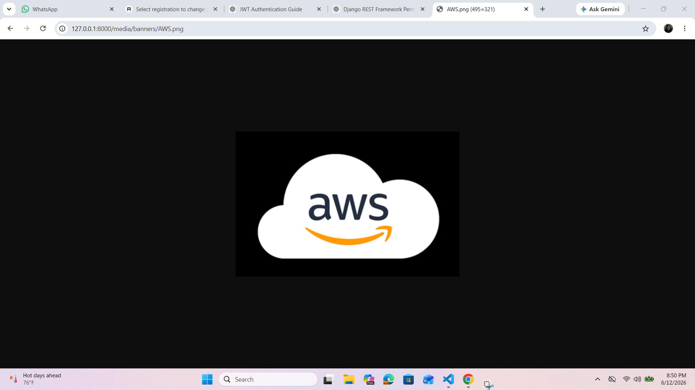

Event Management API

A Django REST Framework backend project for managing events, organizers, and user registrations.

Day 1 : Setup and model creation

Setup Instructions
~~~bash
uv init
uv add django 
uv run django-admin startproject config .
uv run python startapp events
code .
uv run python manage.py runserver
~~~

Installed dependencies:
~~~bash
uv add django
uv add djangorestframework
uv add djangorestframework-simplejwt
uv add drf-yasg
uv add django-jazzmin
uv add Pillow
uv add django-environ
uv add django-filter
~~~

Created three models:
Organizer, Events, Registrartion

Day 2: CRUD + Admin (Jazzmin)
Implemented full CRUD functionality using Django REST Framework with ModelViewSet and DefaultRouter.

- Created Serializers for Organizer, Event, Registration
- Implemented ModelViewSet for all models (CRUD operations)
- Configured DefaultRouter for automatic API URL generation

Admin Panel (Jazzmin)

- Customized Django admin using Jazzmin theme
- Configured Organizer, Event, Registration admin panels
- Added list_display, search_fields, and filters
- Implemented Inline Registration inside Event admin
- Added readonly fields for timestamps (created_at, updated_at)

built REST APIs with full CRUD operations and a modern admin panel using Jazzmin.

Day 3 – JWT Auth + File Upload (DRF)
JWT Authentication (SimpleJWT)
~~~bash
uv add djangorestframework-simplejwt
~~~

settings.py
~~~bash
REST_FRAMEWORK = {
    "DEFAULT_AUTHENTICATION_CLASSES": (
        "rest_framework_simplejwt.authentication.JWTAuthentication",
    ),
}
~~~

URLs (Project level)
~~~bash
from rest_framework_simplejwt.views import TokenObtainPairView, TokenRefreshView

urlpatterns += [
    path("api/token/", TokenObtainPairView.as_view()),
    path("api/token/refresh/", TokenRefreshView.as_view()),
]
~~~

Endpoints:
/api/token/ → login (get access + refresh token)
/api/token/refresh/ → refresh access token

Permission Setup
~~~bash
from rest_framework.permissions import IsAuthenticatedOrReadOnly

permission_classes = [IsAuthenticatedOrReadOnly]
~~~

File Upload (Media Setup)
settings.py
~~~bash
MEDIA_URL = "/media/"
MEDIA_ROOT = BASE_DIR / "media"
~~~

urls.py project level:
~~~bash
from django.conf import settings
from django.conf.urls.static import static

if settings.DEBUG:
    urlpatterns += static(settings.MEDIA_URL, document_root=settings.MEDIA_ROOT)
~~~

Added in model.py:
image = models.ImageField(upload_to="banners/")

Files stored in: media/banners/
DB stores: banners/filename.jpg
Access URL: http://127.0.0.1:8000/media/banners/filename.jpg

