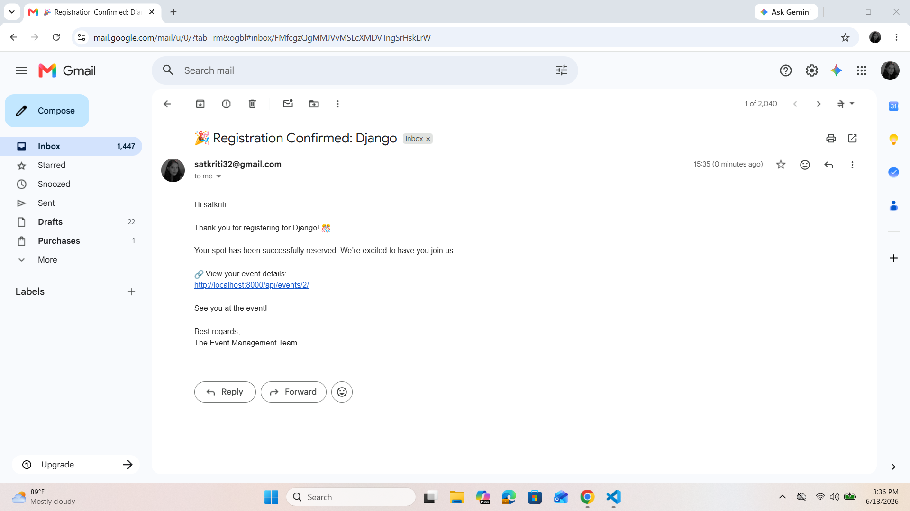

Event Management API

A Django REST Framework backend project for managing events, organizers, and user registrations.

 Features

- User Authentication (JWT)
- Event CRUD (Create, Read, Update, Delete)
- Event Registration system
- Email notifications (SMTP - Gmail)
- API Documentation using Swagger & ReDoc
- Secure environment variables using `.env`

Day 1 : Setup and model creation

Clone Repository

```bash
git clone https://github.com/bhandarisatkriti/event_management_api.git

```

Setup Instructions
~~~bash
uv init
uv add django 
uv run django-admin startproject config .
uv run python startapp events
code .
uv run python manage.py runserver
~~~

Installed dependencies:
~~~bash
uv add django
uv add djangorestframework
uv add djangorestframework-simplejwt
uv add drf-yasg
uv add django-jazzmin
uv add Pillow
uv add django-environ
uv add django-filter
~~~


Created three models:
Organizer, Events, Registration

Day 2: CRUD + Admin (Jazzmin)
Implemented full CRUD functionality using Django REST Framework with ModelViewSet and DefaultRouter.

- Created Serializers for Organizer, Event, Registration
- Implemented ModelViewSet for all models (CRUD operations)
- Configured DefaultRouter for automatic API URL generation

Admin Panel (Jazzmin)

- Customized Django admin using Jazzmin theme
- Configured Organizer, Event, Registration admin panels
- Added list_display, search_fields, and filters
- Implemented Inline Registration inside Event admin
- Added readonly fields for timestamps (created_at, updated_at)

Built REST APIs with full CRUD operations and a modern admin panel using Jazzmin.

Day 3 – JWT Auth + File Upload (DRF)
JWT Authentication (SimpleJWT)
~~~bash
uv add djangorestframework-simplejwt
~~~

settings.py
~~~bash
REST_FRAMEWORK = {
    "DEFAULT_AUTHENTICATION_CLASSES": (
        "rest_framework_simplejwt.authentication.JWTAuthentication",
    ),
}
~~~

URLs (Project level)
~~~bash
from rest_framework_simplejwt.views import TokenObtainPairView, TokenRefreshView

urlpatterns += [
    path("api/token/", TokenObtainPairView.as_view()),
    path("api/token/refresh/", TokenRefreshView.as_view()),
]
~~~

Endpoints:
/api/token/ → login (get access + refresh token)
/api/token/refresh/ → refresh access token

Permission Setup
~~~bash
from rest_framework.permissions import IsAuthenticatedOrReadOnly

permission_classes = [IsAuthenticatedOrReadOnly]
~~~

File Upload (Media Setup)
settings.py
~~~bash
MEDIA_URL = "/media/"
MEDIA_ROOT = BASE_DIR / "media"
~~~

urls.py project level:
~~~bash
from django.conf import settings
from django.conf.urls.static import static

if settings.DEBUG:
    urlpatterns += static(settings.MEDIA_URL, document_root=settings.MEDIA_ROOT)
~~~

Added in model.py:
image = models.ImageField(upload_to="banners/")

Files stored in: media/banners/
DB stores: banners/filename.jpg
Access URL: http://127.0.0.1:8000/media/banners/filename.jpg

Day 4: Email Configuration & Swagger Documentation

Email Configuration (SMTP)

Installed `django-environ` to securely manage sensitive credentials using a `.env` file.

`.env` File

Created a `.env` file in the project root:

```env
EMAIL_HOST_USER=your_email@gmail.com
EMAIL_HOST_PASSWORD=your_16_digit_app_password
```

Added `.env` to `.gitignore` to prevent credentials from being pushed to GitHub.

---

`settings.py` Changes

Imported `django-environ` and loaded environment variables:

```python
import environ

env = environ.Env()
environ.Env.read_env()
```

Configured the Gmail SMTP email backend:

```python
EMAIL_BACKEND = "django.core.mail.backends.smtp.EmailBackend"

EMAIL_HOST = "smtp.gmail.com"
EMAIL_PORT = 587
EMAIL_USE_TLS = True

EMAIL_HOST_USER = env("EMAIL_HOST_USER")
EMAIL_HOST_PASSWORD = env("EMAIL_HOST_PASSWORD")
```

---

Email Trigger

Imported `send_mail` and added email functionality in the event registration endpoint:

```python
from django.core.mail import send_mail
from django.conf import settings
```

Example:

```python
send_mail(
    subject="Event Registration Confirmation",
    message="You have successfully registered for the event.",
    from_email=settings.EMAIL_HOST_USER,
    recipient_list=[user.email],
)
```


Swagger API Documentation (`drf-yasg`)

Installed `drf-yasg` for interactive API documentation.

`settings.py` Changes

Added `drf_yasg` to `INSTALLED_APPS`:

```python
INSTALLED_APPS = [
    ...
    "drf_yasg",
]
```

---

`config/urls.py` Imports

```python
from rest_framework import permissions
from drf_yasg.views import get_schema_view
from drf_yasg import openapi
```

---

Created Swagger Schema View

```python
schema_view = get_schema_view(
    openapi.Info(
        title="Event Management API",
        default_version="v1",
        description="API documentation for Event Management System",
    ),
    public=True,
    permission_classes=(permissions.AllowAny,),
)
```

---

Added Swagger & ReDoc URLs

```python
urlpatterns = [
    path(
        "swagger/",
        schema_view.with_ui("swagger", cache_timeout=0),
        name="swagger",
    ),
    path(
        "redoc/",
        schema_view.with_ui("redoc", cache_timeout=0),
        name="redoc",
    ),
]
```

---

The email was successfully tested and received in the Gmail inbox after event registerd.

---



▶ How to Run Project

```bash
uv run python manage.py makemigrations
uv run python manage.py migrate
uv run python manage.py createsuperuser
uv run python manage.py runserver
```

Final Outcome

- Fully functional REST API for event management
- JWT authentication secured endpoints
- Email confirmation system working via Gmail SMTP
- Swagger & ReDoc API documentation available
- Admin panel enhanced with Jazzmin theme
- Media upload system implemented

Sakriti Bhandari  
Django REST Framework Internship Project


